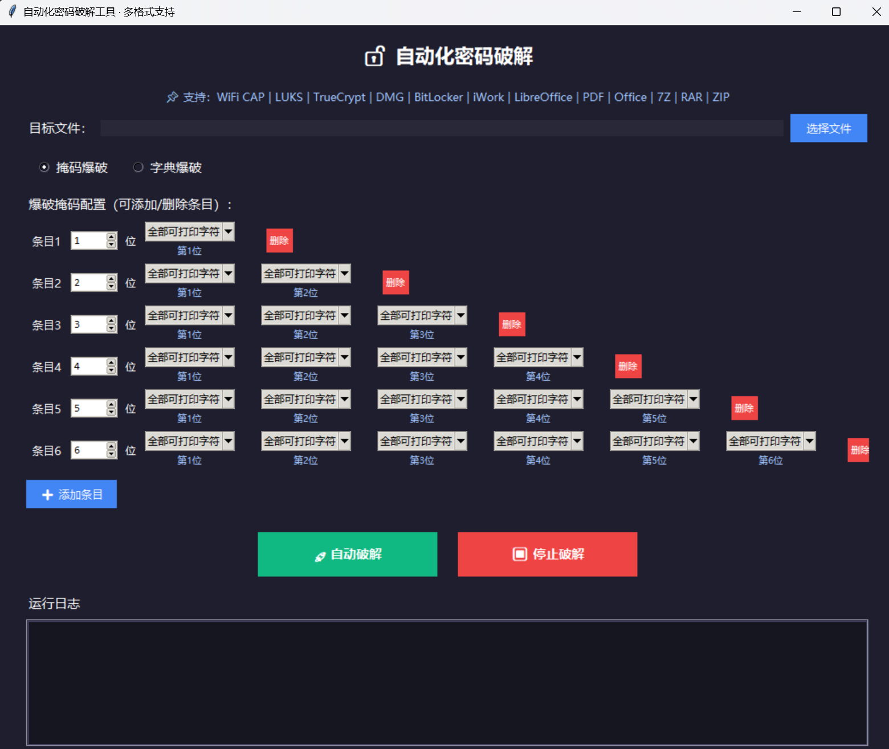
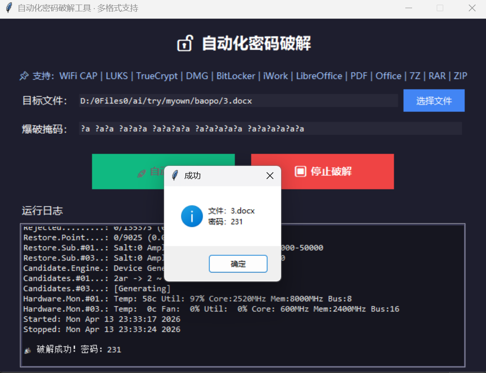
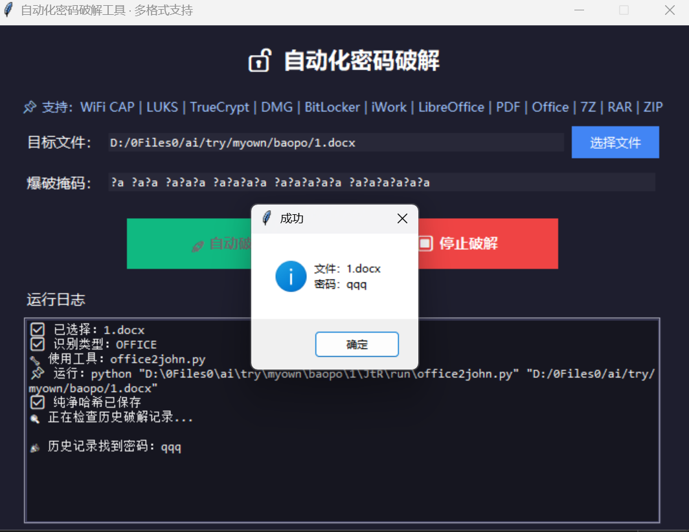

# AutoHashCrackerGUI -- 自动化密码破解工具
一款图形界面、一键运行、多格式兼容的自动化密码破解工具，专为 **CTF 竞赛** 和 **个人密码遗忘恢复** 设计，无需复杂命令，开箱即用。

## 功能亮点
- 可视化图形界面，无需命令行操作
- 多类型文件自动识别，一键爆破
- 支持掩码暴力破解，自定义长度与字符集
- 自动读取历史破解记录，重复文件秒出结果
- 基于 Hashcat 引擎，支持 GPU 加速
- 支持安全停止、实时日志输出
- 自动提取哈希，无需手动转换

## 支持格式
- Office 系列：doc、docx
- 压缩包：zip、rar、7z
- 文档：pdf
- WiFi 握手包：cap、hccapx
- 磁盘加密：BitLocker、DMG、LUKS、TrueCrypt / VeraCrypt
- 办公套件：iWork、LibreOffice

## 破解模式
### 掩码暴力破解（默认）
?a ?a?a ?a?a?a ?a?a?a?a ?a?a?a?a?a ?a?a?a?a?a?a 适用于密码长度较短、仅记得长度范围、个人文件密码遗忘等场景。
### 历史密码自动匹配
工具会自动读取 hashcat potfile 历史记录，已破解过的哈希直接显示密码，无需重复爆破。

## 项目结构
├── JtR/ # John the Ripper 哈希提取工具集  
├── hashcat/ # Hashcat 爆破引擎  
├── 7z2hashcat/ # 7z 哈希提取工具  
├── tmp/ # 临时哈希文件（自动生成）  
└── main.py # 主程序

## 使用方法
不需要安装任何库  
python main.py  

## 适用场景
- 个人文档、压缩包、Office 文件密码遗忘找回
- CTF 竞赛 Misc / Crypto 题型密码爆破
- 安全学习、哈希提取与暴力破解实验

## 免责声明
本工具仅用于合法授权的密码恢复、CTF 竞赛及安全学习研究。
严禁用于未经授权的文件破解、数据入侵或其他非法行为，使用后果由使用者自行承担。
